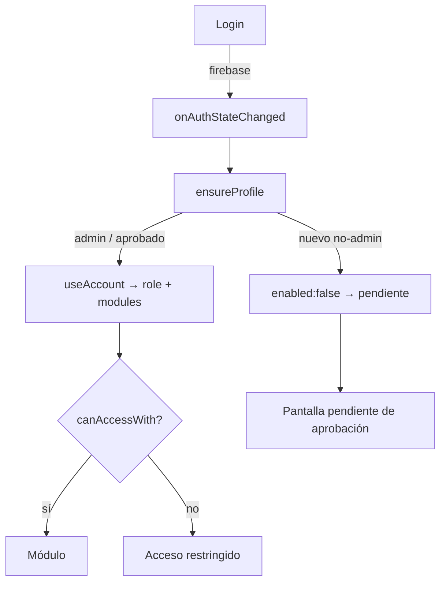

# ZERO Agency OS — Documentación técnica (estado actual)

### Plataforma interna omnicanal · Next.js + Gemini + Firebase
**Versión:** estado de `main` · **Tipo:** referencia de arquitectura

---

## 1. Qué es

**ZERO Agency OS** es una plataforma interna tipo Notion con un **gestor de conciencia** de IA
(Gemini) que integra los datos reales de la agencia (Gmail, Drive, Calendar, GitHub, Telegram,
Slack, Search Console, Analytics), se anticipa, automatiza y reporta.

- **100% client-side**: las credenciales y el estado viven en el navegador; las llamadas van
  directo a las APIs oficiales. **Excepción:** el backend opcional de **Firebase** (Auth +
  Firestore) para el equipo multi-tenant (perfiles, permisos y seguimiento centralizados).
- **Doble despliegue** del mismo código: Vercel (SSR) y GitHub Pages (export estático).

---

## 2. Stack

| Capa | Tecnología |
|---|---|
| Framework | **Next.js 15.5.19** (App Router) + **React 19** + **TypeScript** |
| Estilos | **Tailwind CSS v4** (vars vía `@theme inline`) · diseño *liquid glass* · fuente Outfit |
| Estado | **Zustand** (stores persistidos en `localStorage`) |
| IA | **Gemini** vía REST (sin SDK): `generativelanguage.googleapis.com`, header `X-goog-api-key` |
| Voz | **Gemini TTS neural** (`gemini-2.5-flash-preview-tts`, PCM L16 → WAV) + voz del sistema |
| Backend (opcional) | **Firebase** Auth (Google/GitHub/Facebook) + **Firestore** |
| Iconos | lucide-react |

---

## 3. Estructura del repositorio

```
src/
├─ app/                      # Rutas (App Router) — cada módulo es una página client-side
│  ├─ page.tsx               # Landing (marketing, pública)
│  ├─ docs/                  # Documentación onboarding (pública)
│  ├─ dashboard/ anticipation/ assistant/ zero/ memory/
│  ├─ inbox/ calendar/ drive/ canvas/ monitor/ pages/
│  ├─ autopilot/ reports/ runs/ connectors/ setup/
│  └─ profile/ team/         # Perfil propio + consola de admin (multi-tenant)
├─ components/
│  ├─ AppShell.tsx           # Layout, puerta de acceso, daemons, route guard
│  ├─ Sidebar.tsx            # Navegación filtrada por rol + identidad
│  ├─ LoginGate.tsx          # Login social (Firebase) o por clave (compat)
│  ├─ AuthListener.tsx       # onAuthStateChanged + perfil en vivo
│  └─ *Daemon.tsx            # Procesos headless: autonomía, monitor, briefing, reportes, banco
└─ lib/
   ├─ ai/                    # Agente, cliente, tools, memoria, banco de datos, runs
   ├─ anticipation/          # Motor de anticipación, autonomía, madurez
   ├─ connectors/            # Google, GitHub, Telegram, Slack, webhooks, insights
   ├─ firebase/              # app, auth, profiles, session, track
   ├─ monitor/               # Uptime/latencia del sitio
   ├─ account.ts rbac.ts auth.ts   # Acceso unificado + roles
   └─ reports.ts briefing.ts reportPdf.ts voiceGemini.ts ...
```

---

## 4. Módulos (rutas funcionales)

| Ruta | Función |
|---|---|
| `/` · `/docs` | Landing y documentación (públicas) |
| `/dashboard` | Estado general, bandeja en vivo, briefing, anticipaciones |
| `/anticipation` | Anticipaciones, escalera de confianza, madurez, auditoría |
| `/assistant` · `/zero` | Copiloto Gemini en texto y por voz (streaming) |
| `/memory` | Hechos que ZERO recuerda entre sesiones |
| `/inbox` · `/calendar` · `/drive` | Datos reales de Google (Gmail/Calendar/Drive) |
| `/canvas` | Canvas / grafo del workspace |
| `/monitor` | Uptime y latencia del sitio de la agencia |
| `/pages` | Workspace tipo Notion (páginas/subpáginas) |
| `/autopilot` | Piloto automático: autonomía + briefing programado *(admin)* |
| `/reports` | Reportes diario/semanal/mensual + export PDF de marca |
| `/runs` | Trazabilidad de ejecuciones del agente |
| `/connectors` | Configuración de integraciones y API key de Gemini |
| `/setup` | Diagnóstico en vivo de APIs + estado de acceso *(admin)* |
| `/profile` | Perfil propio (identidad, rol, módulos) |
| `/team` | Consola de admin: aprobar, roles, permisos, actividad *(admin)* |

---

## 5. Capa de IA (`src/lib/ai/`)

- **`agent.ts` — `runAgent(userText, history, onStep, source, onToken)`**: agente Gemini con
  *function calling*. Inyecta contexto del **banco de datos** y de la **memoria**; ejecuta
  herramientas client-side y responde. Streaming SSE (`streamGenerateContent?alt=sse`) por
  token. Registra cada corrida en `runs` y dispara `track()` (seguimiento por persona).
- **`client.ts`**: helpers REST + `speedConfig(model)` → `thinkingBudget: 0` en modelos
  `2.5/3.x` para latencia mínima.
- **`tools.ts`**: declaraciones + ejecución de herramientas (correo, calendario, drive,
  github, sitio, SEO, memoria, anticipación, análisis de agencia…).
- **`memory.ts`**: `remember / recall / forget` + `memoryContext()`.
- **`dataBank.ts`**: caché caliente en segundo plano (Gmail, Calendar, GitHub, Drive, sitio)
  → `bankContext()` para respuestas **instantáneas** sin round-trips.
- **`runs.ts`**: historial auditable de ejecuciones del agente.

---

## 6. Gestor de conciencia (`src/lib/anticipation/`)

Bucle gobernado con guardrails:

1. **`engine.ts` — Anticipación**: reglas deterministas sobre señales reales → próximas
   mejores acciones con confianza, lead-time y la señal que las justifica. Escalera
   `shadow → suggest → auto`, opt-out y feedback.
2. **`autonomy.ts` — Autonomía**: demonio que promueve a ejecución las anticipaciones por
   encima del umbral, con **guardrails** (tope por ciclo, cooldown, solo acciones reversibles).
   `markActed` solo en éxito; en fallo reintenta el próximo ciclo.
3. **`maturity.ts`**: modelo de madurez (de reactivo a autónomo).

Daemons headless montados en `AppShell`: `AutonomyDaemon`, `MonitorDaemon`, `BriefingDaemon`,
`ReportsDaemon`, `DataBankDaemon`.

---

## 7. Conectores (`src/lib/connectors/`)

- **Google** (`google.ts`, `googleConnect.ts`, `googleInsights.ts`): OAuth vía GIS token
  client (sin secreto). Scopes de solo lectura: Gmail, Drive, Calendar, Search Console,
  Analytics (GA4). Un clic conecta Gmail+Drive+Calendar.
- **GitHub** (`github.ts`): repos, PRs, issues, commits (token o usuario público).
- **Telegram / Slack** (`telegram.ts`, `slack.ts`): alertas del equipo.
- **Webhooks salientes** (`webhooks.ts`): Zapier/Make/n8n/Discord.

---

## 8. Voz (`src/lib/voiceGemini.ts`, `voice.ts`)

- **TTS neural de Gemini** con voces prebuilt (Charon por defecto, estilo JARVIS).
- Pipeline frase a frase (`speakGeminiQueued`): sintetiza y reproduce la primera mientras
  prefetchea la siguiente → empieza a hablar casi al instante.
- AudioContext/Analyser único por sesión (sin fugas) + visualizador.
- Fallback a la voz del sistema si no hay API key/TTS.

---

## 9. Acceso, roles y multi-tenant

Capa unificada en **`account.ts`** con tres modos (`authMode`):

| Modo | Cuándo | Identidad |
|---|---|---|
| **firebase** | Hay config `NEXT_PUBLIC_FIREBASE_*` | Login social + perfil en Firestore |
| **password** | Hay `NEXT_PUBLIC_APP_USERS` o `APP_PASSWORD` | Clave por rol (sin backend) |
| **open** | Nada configurado | Admin con acceso total |

- **`rbac.ts`**: roles `admin | comercial | dev`, mapa de rutas permitidas, `MODULES` y
  **`canAccessWith(role, path, overrides)`** (override por usuario manda sobre el rol; `/team`
  siempre solo-admin).
- **Firebase** (`src/lib/firebase/`): `auth` (Google/GitHub/Facebook), `profiles`
  (perfil + actividad en Firestore, suscripción en vivo), `session`, `track`.
- **`/team`** (admin): aprobar/bloquear, asignar rol, activar/desactivar módulos por persona,
  ver actividad. Cambios **en vivo** en la sesión de cada persona.
- **`firestore.rules`**: un usuario **no puede** cambiarse su rol/enabled/modules; nuevos
  usuarios entran deshabilitados (pendientes de aprobación). La config web de Firebase es
  pública por diseño; la seguridad la imponen las reglas.



---

## 10. Reportes, briefing y monitoreo

- **`reports.ts` + `reportPdf.ts`**: reportes diario/semanal/mensual generados por el agente,
  exportables a **PDF con la marca**; autogeneración idempotente por clave de periodo (hora
  **local**, no UTC).
- **`briefing.ts`**: briefing del día (envío programado a canales; dedup por día local).
- **`monitor/`**: uptime/latencia del sitio; las caídas se convierten en anticipaciones.

---

## 11. Persistencia y seguridad

- **Estado del workspace, conectores, memoria, etc.** → `localStorage` (Zustand `persist`,
  con `partialize` para no persistir estado transitorio).
- **Credenciales** → solo en el navegador (OAuth tokens, API key de Gemini); nada se versiona.
- **HTML generado** → renderizado en iframes `sandbox`; respaldo/restauración (`backup.ts`).
- **Firebase** → secretos del lado servidor no aplican (config pública); reglas Firestore
  imponen el control de acceso por rol.

---

## 12. Build y despliegue

- **Vercel (SSR):** `npm run build`.
- **GitHub Pages (export estático):** `NEXT_OUTPUT_EXPORT=true npm run build` → publica a la
  rama `gh-pages` (workflow `pages.yml`, `peaceiris/actions-gh-pages`).
- PWA instalable + modo oscuro + mobile-first.

> ⚠️ Las variables `NEXT_PUBLIC_*` se **incrustan en tiempo de build**. Para GitHub Pages hay
> que exponerlas en el `env:` del workflow (idealmente desde GitHub Secrets).

---

## 13. Variables de entorno

| Variable | Uso |
|---|---|
| `NEXT_PUBLIC_GOOGLE_CLIENT_ID` | OAuth Google (1 clic) |
| `NEXT_PUBLIC_AGENCY_EMAIL` | Correo mostrado en la UI |
| `NEXT_PUBLIC_FIREBASE_*` | Backend de equipo (Auth + Firestore) |
| `NEXT_PUBLIC_ADMIN_EMAILS` | Correos admin (coinciden con `firestore.rules`) |
| `NEXT_PUBLIC_AUTH_PROVIDERS` | Proveedores sociales a mostrar |
| `NEXT_PUBLIC_APP_USERS` | Equipo multi-rol por clave (sin Firebase) |
| `NEXT_PUBLIC_APP_PASSWORD[_SHA256]` | Clave única (un admin) |
| `NEXT_PUBLIC_BASE_PATH` | Subruta para GitHub Pages |
| `NEXT_OUTPUT_EXPORT` | Activa el export estático |

La API key de Gemini **no** va en entorno: se pega en `Conectores → Asistente IA` y vive en el
navegador.

---

## 14. Estado actual y pendientes (lado usuario)

**Hecho y en `main`:** todo lo anterior (IA + voz + anticipación/autonomía + conectores +
reportes/briefing/monitor + liquid glass + login por clave/rol + **multi-tenant con Firebase**
+ perfiles/permisos/seguimiento + landing + docs). Más la **especificación PamaMotors**
(`docs/OMNICANAL_PAMAMOTORS.md`).

**Pendiente (configuración del usuario, no código):**
- Rotar la API key de Gemini que se compartió en chat (exposición).
- Apuntar **GitHub Pages → branch `gh-pages`** (o reconectar Vercel) para el deploy.
- Para activar el equipo: crear proyecto **Firebase**, habilitar proveedores, pegar
  `firestore.rules` y definir `NEXT_PUBLIC_FIREBASE_*` + `NEXT_PUBLIC_ADMIN_EMAILS` en el build.

---

### Apéndice — Documentos relacionados en `docs/`
- `OMNICANAL_PAMAMOTORS.md` — captación PamaMotors + procesador ZERO.
- `GOBIERNO_DE_DATOS.md` — certificación de gobierno de datos.
- `ENTREGA_DAFTON_MEDIA.md` — entregable.
