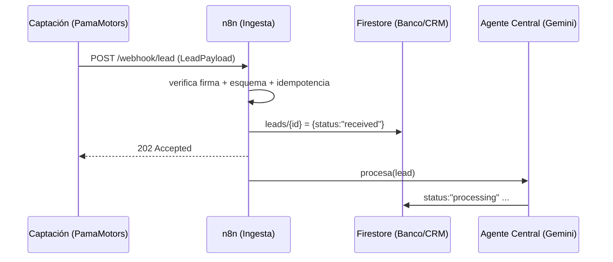
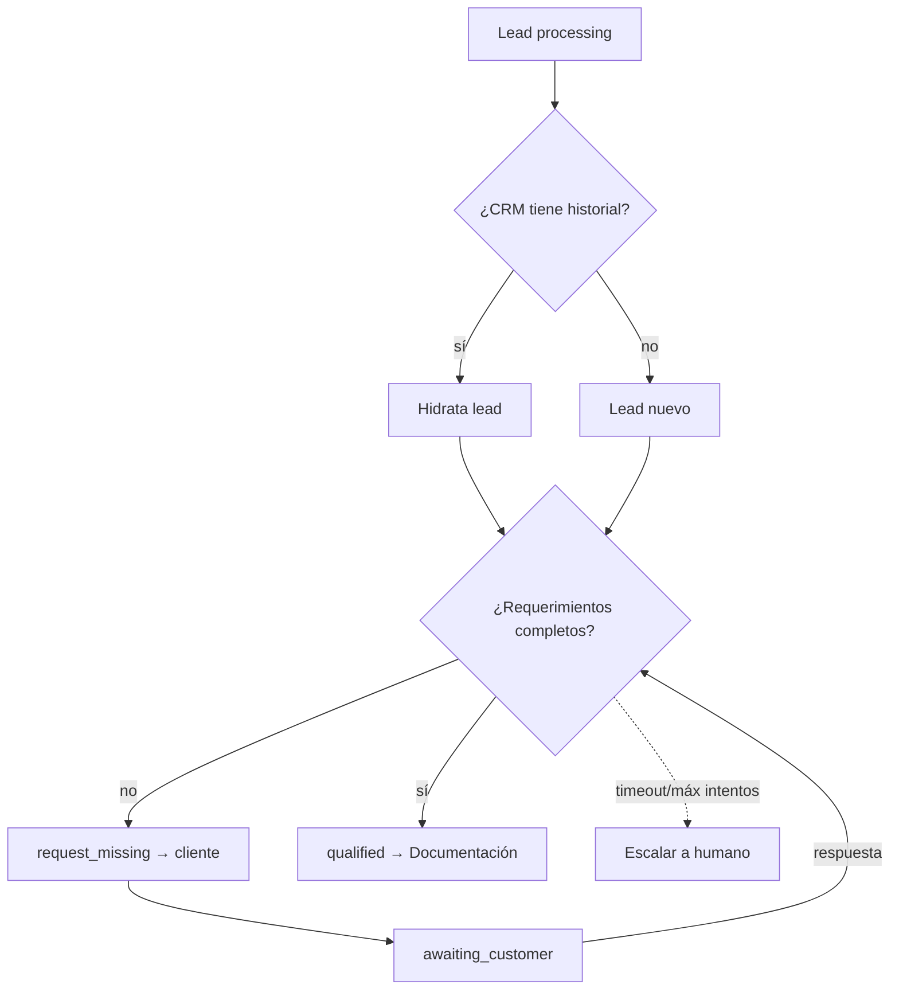

# Omnicanal ZERO × PamaMotors — Especificación técnica de implementación

### Zero Agency OS · Captación de leads (PamaMotors) + Procesador omnicanal (ZERO)
**Versión:** 1.0 · **Estado:** propuesta de implementación
**Basado en:** diagrama de arquitectura "Gestor de Conciencia" (IMG_1589)

---

## 0. Resumen ejecutivo

Dos sistemas, un solo flujo:

1. **PamaMotors = capa de captación (Lead Capture).** Todos los canales del concesionario
   (web, WhatsApp, Meta/Instagram Lead Ads, Google, correo, llamadas) se normalizan en un
   **único origen de lead** (*Single Lead Source*) con un payload canónico.
2. **ZERO Omnicanal = procesador (Lead Processor).** Recibe el lead, lo enriquece, lo evalúa
   con el **Agente Central (Gemini · Gestor de Conciencia)**, pasa por los **Orquestadores de
   Requerimientos y Documentación**, valida en un **bucle de retroalimentación** y lo
   **distribuye** (B2B / asesor comercial) con respuesta omnicanal al cliente.

El "cerebro" autónomo corre en una **VM con n8n** (orquestación server-side 24/7) usando
Gemini por REST; **ZERO OS** (la app Next.js que ya tienes) es el **cockpit humano**: bandeja
de leads, copiloto, CRM, reportes y panel de control de equipo.

> ### ✅ Estado de implementación (en este repo)
> Ya está construido y listo para **solo configurar las herramientas externas**:
> - **Cockpit de Leads** en el OS: `/leads` (rol comercial/admin) — lista en vivo, asignar,
>   cambiar estado, notas y **responder por WhatsApp** desde la app.
> - **Conector Meta** (WhatsApp/Facebook/Instagram) + Meta en el **banco de datos**.
> - **Workflows de n8n** en `infra/n8n/`: ingesta web, WhatsApp inbound, Meta Lead Ads y el
>   **Agente Central** (calificación + bucle de feedback por WhatsApp).
> - **Reglas Firestore** para `leads` en `firestore.rules`.
>
> Falta solo (lado usuario): crear el proyecto Firebase, las apps de Meta y el n8n, y pegar
> tokens/IDs. Guía paso a paso en `infra/n8n/README.md`.

---

## 1. Arquitectura — del diagrama a componentes reales

| En el diagrama | Componente real | Tecnología |
|---|---|---|
| **VM (Virtual Machine)** | Orquestador server-side 24/7 | VM (GCP/Hetzner/EC2) + Docker |
| **n8n** | Motor de workflows (ingesta, enriquecimiento, distribución) | n8n self-hosted |
| **Markdowns Técnicos** | Base de conocimiento / plantillas / catálogo PamaMotors | Repositorio Markdown + embeddings |
| **Parameters (Google)** | Config dinámica (catálogo, precios, financiación, SLAs) | Google Sheets / Firestore `config` |
| **Agente Central (Gemini)** | Gestor de Conciencia (cognición, evaluación, distribución) | Gemini `2.5/3.x` vía REST |
| **Gestor / Banco** | Banco de datos caliente + CRM | Firestore (+ caché del OS) |
| **Omnicanal** | Procesador de leads (este sistema) | n8n + Firestore + ZERO OS |
| **Orquestador de Requerimientos** | Califica y completa datos del lead | n8n subflow + Gemini |
| **Orquestador de Documentación** | Genera cotización/propuesta/financiación | n8n subflow + plantillas PDF |
| **B2B / Agente** | Distribución a asesor comercial / respuesta | n8n + WhatsApp/Telegram/Email |
| **Mode 2: Feedback Loop** | Validación iterativa de requerimientos | Bucle n8n con estado en Firestore |

```mermaid
flowchart LR
  subgraph PM["PamaMotors · Captación"]
    W[Web / Landing]
    WA[WhatsApp Business]
    META[Meta Lead Ads<br/>FB · IG]
    G[Google Ads / Forms]
    EM[Email entrante]
    TEL[Llamadas / IVR]
  end

  PM -->|normaliza| SLS([Single Lead Source<br/>payload canónico])

  subgraph VM["VM · Procesador (n8n + Gemini)"]
    ING[Ingesta Omnicanal<br/>webhook idempotente]
    AC[Agente Central · Gemini<br/>Gestor de Conciencia]
    OR[Orquestador de<br/>Requerimientos]
    OD[Orquestador de<br/>Documentación]
    DIST[Distribución B2B]
  end

  SLS --> ING --> AC
  AC <--> BANK[(Banco / CRM<br/>Firestore)]
  AC --> OR
  OR <-->|Mode 2: feedback loop| AC
  OR --> OD
  OD --> DIST
  DIST -->|asignación| ASESOR[Asesor comercial]
  DIST -->|respuesta| CLIENTE[Cliente · canal original]

  subgraph OS["ZERO OS · Cockpit humano"]
    INBOX[Bandeja de leads]
    COPILOT[Copiloto Gemini]
    REPORTS[Reportes / KPIs]
    TEAM[Panel de equipo]
  end
  BANK <--> OS
```



**Numeración del diagrama original:**
- **(1)** Lead único → `Structure Lead Payload` → Agente Central.
- **(2)** Ingesta omnicanal → evaluación de contexto → distribución de lógica.

---

## 2. Captación de leads (PamaMotors)

Cada canal tiene un **adaptador** cuya única responsabilidad es traducir su formato nativo al
**payload canónico** y postearlo al webhook de ingesta. Así el procesador no conoce los
detalles de cada canal (principio de *Single Lead Source*).

| Canal | Mecanismo de captura | Adaptador |
|---|---|---|
| **Web / Landing** | Formulario → `POST` directo al webhook | Nativo (fetch) |
| **WhatsApp** | WhatsApp Cloud API (Meta) → webhook | n8n `WhatsApp Trigger` |
| **Meta Lead Ads (FB/IG)** | Lead Ads webhook / Graph API | n8n `Facebook Lead Ads Trigger` |
| **Google** | Google Ads Lead Form Extensions → webhook | n8n `Webhook` + verificación `google_key` |
| **Email** | Buzón `ventas@pamamotors` → parser | n8n `IMAP/Gmail Trigger` + Gemini extractor |
| **Llamadas / IVR** | Transcripción (telefonía) → texto | n8n `Webhook` + Gemini extractor |

**Identidad del canal:** todo lead lleva `source.channel` y `source.campaign` para atribución.

**Anti-spam / validación de origen:** cada webhook valida firma/secreto (`X-Pama-Signature`
HMAC, `hub.verify_token` para Meta, etc.) antes de aceptar el payload.

---

## 3. Contrato de datos — `LeadPayload` (esquema canónico)

Es el **contrato único** entre captación y procesador. Versionado (`schemaVersion`).

```ts
// lead.schema.ts
export interface LeadPayload {
  schemaVersion: "1.0";
  leadId: string;                 // UUID generado en captación (idempotencia)
  receivedAt: string;             // ISO 8601
  source: {
    channel: "web" | "whatsapp" | "meta_fb" | "meta_ig" | "google" | "email" | "call";
    campaign?: string;            // utm_campaign / ad id
    adId?: string;
    referrer?: string;
  };
  contact: {
    fullName?: string;
    phone?: string;               // E.164 (+57...)
    email?: string;
    preferredChannel?: "whatsapp" | "email" | "call";
    consent: boolean;             // habeas data / opt-in (obligatorio CO)
  };
  intent: {                       // intención declarada por el cliente
    rawMessage?: string;          // texto libre original
    vehicleOfInterest?: string;   // "Mazda CX-30", "moto 150cc"...
    newOrUsed?: "nuevo" | "usado";
    budget?: number;              // COP
    financing?: boolean;
    tradeIn?: boolean;            // entrega de vehículo usado
    timeframe?: "inmediato" | "30d" | "90d" | "explorando";
  };
  meta: {
    locale: "es-CO";
    ipCountry?: string;
    attributionId?: string;
  };
}
```

> El bloque `intent` puede llegar **incompleto**: el *Orquestador de Requerimientos* es quien
> lo completa en el bucle de feedback. `contact.consent` es **obligatorio** (Ley 1581 de 2012,
> habeas data Colombia): sin consentimiento no se procesa ni se contacta.

---

## 4. Ingesta omnicanal (el procesador)

**Endpoint** (en n8n, sobre la VM):

```
POST https://omni.pamamotors.<dominio>/webhook/lead
Headers: X-Pama-Signature: <hmac-sha256(body, SECRET)>
Body: LeadPayload (JSON)
```

**Garantías de la ingesta:**
1. **Idempotencia:** `leadId` como clave; si ya existe, se ignora o se *merge*.
2. **Validación de esquema:** rechaza payloads que no cumplan `LeadPayload` (`400`).
3. **Persistencia inmediata:** escribe `leads/{leadId}` en Firestore con `status: "received"`
   **antes** de procesar (no se pierde ningún lead aunque el agente falle).
4. **Respuesta rápida:** `202 Accepted` al canal; el procesamiento es asíncrono.



---

## 5. Agente Central — Gemini · Gestor de Conciencia

Es el cerebro. Recibe el lead y ejecuta el **proceso cognitivo central** en tres pasos
(los del diagrama):

1. **Context Evaluation** — cruza el lead con el **Banco/CRM**: ¿cliente nuevo o recurrente?
   ¿interacciones previas? ¿vehículo disponible en catálogo? ¿campaña activa?
2. **Core Cognitive Process** — clasifica intención, calcula **lead score** y decide la ruta:
   `calificar` → `documentar` → `distribuir`, o `descartar` (spam/sin consentimiento).
3. **Logic Distribution** — invoca a los orquestadores en orden y consolida resultados.

**Implementación:** llamada a Gemini por REST (mismo patrón que ya usa el OS:
`generativelanguage.googleapis.com`, header `X-goog-api-key`, `thinkingBudget` bajo para
latencia). El agente expone **herramientas (function calling)**:

```jsonc
// Herramientas del Agente Central (declaraciones para Gemini)
[
  { "name": "crm_lookup",        "desc": "Busca historial del contacto en el Banco/CRM" },
  { "name": "catalog_match",     "desc": "Empareja la intención con el catálogo PamaMotors" },
  { "name": "score_lead",        "desc": "Calcula lead score 0-100 con reglas + señales" },
  { "name": "request_missing",   "desc": "Pide datos faltantes al cliente (feedback loop)" },
  { "name": "generate_document", "desc": "Dispara el Orquestador de Documentación" },
  { "name": "assign_advisor",    "desc": "Distribuye el lead a un asesor (B2B)" },
  { "name": "reply_customer",    "desc": "Responde por el canal original del cliente" }
]
```

**Estados del lead** (máquina de estados en Firestore `leads/{id}.status`):

```
received → processing → qualifying ⇄ awaiting_customer → qualified
        → documenting → ready_to_distribute → assigned → won | lost | discarded
```

---

## 6. Orquestador de Requerimientos

Completa y valida lo que el negocio necesita para avanzar el lead.

- **Step 1 — Check CRM & History:** consulta `crm_lookup`. Si el contacto existe, hidrata el
  lead con datos previos (vehículos vistos, cotizaciones, visitas) y evita repreguntar.
- **Step 2 — Feedback Loop (Mode 2):** compara el `intent` recibido contra el **conjunto
  mínimo de requerimientos** para cotizar/asignar:

  | Requerimiento | Obligatorio para… |
  |---|---|
  | `contact.phone` o `email` | Contactar |
  | `contact.consent = true` | Cualquier procesamiento |
  | `intent.vehicleOfInterest` | Cotizar |
  | `intent.newOrUsed` | Cotizar |
  | `intent.financing` (+ ingresos si aplica) | Simulación de crédito |
  | `intent.tradeIn` (+ datos del usado) | Avalúo |

  Si falta algo, el agente usa `request_missing` → manda **una sola pregunta consolidada** por
  el canal preferido (WhatsApp por defecto), pasa el lead a `awaiting_customer` y **espera la
  respuesta** (webhook entrante reanuda el bucle). Máx. `N` iteraciones / `T` horas antes de
  escalar a un humano.



---

## 7. Orquestador de Documentación

Convierte un lead calificado en **documentos de marca PamaMotors**, reutilizando el motor de
PDF con branding que ya existe en el OS (mismo enfoque que los reportes).

| Documento | Insumos | Salida |
|---|---|---|
| **Cotización** | Vehículo + precio (catálogo) + descuentos de campaña | PDF + enlace |
| **Simulación de financiación** | Monto, cuota inicial, plazo, tasa (`Parameters`) | PDF + tabla |
| **Ficha del vehículo** | Catálogo / Markdowns Técnicos | PDF / mensaje |
| **Propuesta / orden de pedido** | Cotización aceptada | PDF para firma |

- Plantillas en **Markdowns Técnicos** + datos dinámicos desde **`Parameters` (Google
  Sheets/Firestore)** → así ventas actualiza precios sin tocar código.
- El documento se guarda en `leads/{id}/documents/{docId}` (Drive/Storage) y se adjunta a la
  respuesta omnicanal.

---

## 8. Distribución B2B / Agente

Lead calificado + documentado → **se asigna y se responde**.

- **Asignación (`assign_advisor`):** round-robin / por sucursal / por línea (autos vs motos) /
  por carga del asesor. SLA de primer contacto (p. ej. < 5 min en horario hábil).
- **Notificación al asesor:** Telegram/WhatsApp/Email con ficha del lead + score + documentos
  + acción "tomar lead" (deep link al cockpit ZERO OS).
- **Respuesta al cliente (`reply_customer`):** por el **canal original**, con la cotización y
  siguiente paso (agendar test drive / visita).
- **Registro:** `assigned` + `ownerId` + timestamps de SLA para reporting.

---

## 9. n8n en la VM — workflows

| Workflow | Trigger | Función |
|---|---|---|
| `wf-ingest` | Webhook `/lead` + triggers de canal | Normaliza → valida → persiste → 202 |
| `wf-agent` | Llamado por `wf-ingest` | Orquesta el Agente Central (Gemini) |
| `wf-requirements` | Subflow | Step 1/2 + feedback loop |
| `wf-docs` | Subflow | Genera documentos |
| `wf-distribute` | Subflow | Asigna + notifica + responde |
| `wf-resume` | Webhook entrante (respuesta cliente) | Reanuda `awaiting_customer` |
| `wf-sla-monitor` | Cron (cada min) | Escala leads sin atender / sin respuesta |

**Por qué n8n y no solo el OS:** el procesamiento debe correr **sin navegador abierto, 24/7,
y con secretos server-side** (service account de Firestore, tokens de WhatsApp/Meta). El OS
client-side no puede sostener eso; n8n en la VM sí. El OS consume el resultado desde Firestore.

---

## 10. Modelo Firestore (Banco / CRM) + reglas

```
contacts/{contactId}                 // persona única (dedup por phone/email)
  ├─ profile, consent, tags, score
  └─ interactions/{id}               // timeline omnicanal
leads/{leadId}
  ├─ payload (LeadPayload), status, score, ownerId, slaAt
  ├─ requirements/{...}              // estado del bucle de feedback
  ├─ documents/{docId}              // cotizaciones/propuestas
  └─ events/{id}                     // trazabilidad de estados
config/parameters                    // precios, tasas, catálogo, SLAs, round-robin
catalog/{vehicleId}                  // inventario PamaMotors
```

**Reglas:** los **clientes finales no acceden** a Firestore (todo entra por n8n con service
account). El **cockpit ZERO OS** lee/escribe según el rol multi-tenant ya implementado
(admin / comercial / dev) — reutiliza `firestore.rules` y la consola de equipo: cada asesor
ve **sus** leads, el admin ve todo.

---

## 11. Seguridad, idempotencia y observabilidad

- **Idempotencia** por `leadId` en cada paso (reintentos seguros).
- **Firmas/secretos** por canal (HMAC, verify tokens) y rate-limiting en la ingesta.
- **Habeas data (CO):** `consent` obligatorio; canal de baja (`STOP`); retención y borrado.
- **PII:** secretos solo server-side (n8n/VM); nada de tokens en el bundle del OS.
- **Dead-letter:** leads que fallan N veces → `leads_dlq` + alerta a admin.
- **Trazabilidad:** cada transición de estado en `leads/{id}/events` (auditable en `/runs` del OS).
- **Idempotencia del agente:** las acciones externas (responder, asignar) se marcan `actedAt`
  para no duplicar mensajes (mismo patrón que la autonomía del OS).

---

## 12. Métricas / KPIs (reutiliza Reportes del OS)

- Leads por canal/campaña, **tasa de calificación**, lead score medio.
- **Tiempo de primer contacto** vs SLA, tasa de respuesta del cliente en el feedback loop.
- Cotizaciones generadas, **conversión lead→venta**, leads por asesor, motivos de descarte.
- Reportes **diario/semanal/mensual** con la marca PamaMotors (motor ya existente).

---

## 13. Roadmap por fases

| Fase | Alcance | Entregable | Estado |
|---|---|---|---|
| **F0 — Cimientos** | Esquema `LeadPayload` + webhook ingesta + Firestore + cockpit | Leads persistidos y visibles en `/leads` | ✅ Listo (falta configurar n8n/Firebase) |
| **F1 — Captación** | Adaptadores Web + WhatsApp + Meta Lead Ads | Single Lead Source operativo | ✅ Workflows en `infra/n8n/` |
| **F2 — Agente** | Agente Central (Gemini) + scoring | Leads clasificados y enrutados | ✅ `wf-agent-central.json` |
| **F3 — Requerimientos** | Feedback loop (Mode 2) por WhatsApp | Leads autocompletados/calificados | ✅ Incluido en el Agente Central |
| **F4 — Documentación** | Cotización + financiación PDF de marca | Documentos automáticos | ⏳ Pendiente |
| **F5 — Distribución** | Asignación + SLA + respuesta omnicanal | Ciclo cerrado | 🟦 Parcial (asignar/responder ya en `/leads`; falta round-robin/SLA) |
| **F6 — Analítica** | KPIs + reportes + optimización | Tablero de conversión | ⏳ Pendiente |

---

## 14. Configuración / variables de entorno

**VM / n8n (server-side, secretas):**
```
GEMINI_API_KEY=                 # Generative Language API
FIREBASE_SERVICE_ACCOUNT=       # JSON service account (Firestore admin)
WHATSAPP_TOKEN=  WHATSAPP_PHONE_ID=  WHATSAPP_VERIFY_TOKEN=
META_APP_SECRET=  META_VERIFY_TOKEN=
PAMA_WEBHOOK_SECRET=            # HMAC de la ingesta web
GOOGLE_SHEETS_PARAMS_ID=        # hoja de Parameters
```

**ZERO OS (cockpit, NEXT_PUBLIC_* — ya existentes):**
```
NEXT_PUBLIC_FIREBASE_*          # mismo proyecto Firestore (lectura/escritura por rol)
NEXT_PUBLIC_ADMIN_EMAILS
```

> **Una sola base de datos** (Firestore) compartida entre n8n (admin, server) y ZERO OS
> (operadores, por rol) mantiene captación, procesamiento y cockpit perfectamente sincronizados.

---

### Apéndice — Mapa rápido "diagrama → este documento"

- *Single Lead Source / Structure Lead Payload* → **§2–§3**
- *Omnicanal · Ingest Lead + Requirements* → **§4**
- *Agente Central (Gemini) · Core Cognitive / Context Eval / Logic Distribution* → **§5**
- *Orquestador de Requerimientos · Step 1/2 · Feedback Loop (Mode 2)* → **§6**
- *Orquestador de Documentación* → **§7**
- *B2B / Agente · Distributed* → **§8**
- *VM · n8n · Markdowns Técnicos · Parameters* → **§9**
- *Gestor / Banco* → **§10**
